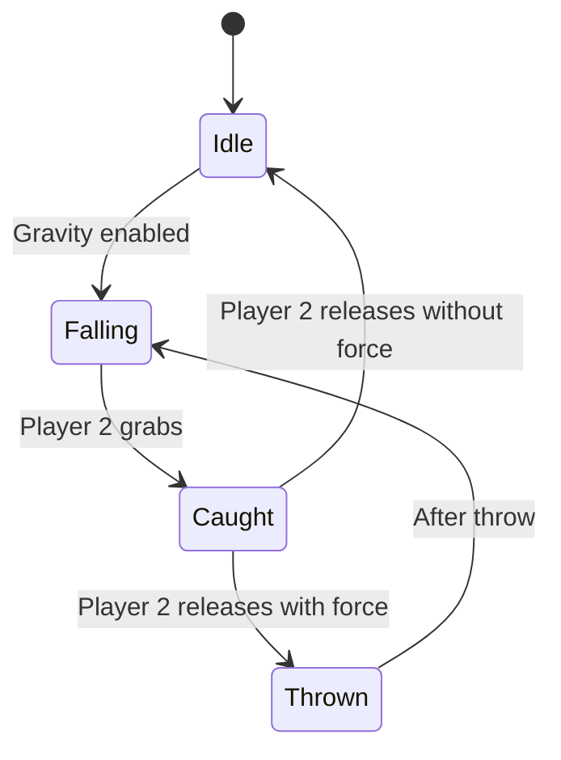

# Catch and Throw Mechanics Design

## Overview

Introduce a cooperative mechanic where **Player 2** can **catch**, **reposition**, and **throw** falling or movable objects to assist **Player 1**. This enhances teamwork, timing, and puzzle complexity.

---

## Core Concepts

- **Catch:** Player 2 grabs a falling or movable object mid-air.
- **Hold:** While caught, the object is suspended and can be repositioned.
- **Throw:** Player 2 releases the object, optionally applying a directional force.
- **Applications:**
  - Catch falling hazards (e.g., spikes) to protect Player 1.
  - Move platforms into place for Player 1 to jump on.
  - Deliver power-ups or keys to Player 1.
  - Block or redirect hazards.

---

## Object Types

- **ThrowableObject (base class)**
  - Inherits from `MonoBehaviour` or `Hazard`
  - Supports catch, hold, throw states
- **FallingSpikes**
  - Extend to support catch/throw
- **MovablePlatform**
  - Can be caught and repositioned
- **PowerUp**
  - Can be thrown to Player 1
- **PuzzleKey**
  - Can be delivered via throw

---

## States and Transitions

---

## Behaviors

### Catch
- Detect Player 2 input (click/drag)
- Disable gravity
- Zero velocity
- Follow Player 2's cursor

### Hold
- Object follows Player 2's drag
- Visual feedback (highlight, glow)

### Throw
- On release, apply force based on drag velocity/direction
- Re-enable gravity
- Resume physics

### Collision
- If object hits Player 1 while active hazard, apply damage
- If object is platform or power-up, allow interaction

---

## Implementation Outline

1. **Create `ThrowableObject` base class**
   - Fields: `isCaught`, `Rigidbody2D`, `Collider2D`
   - Methods: `Catch()`, `Release(Vector2 throwForce)`
2. **Extend `FallingSpikes` to support catch/throw**
3. **Create `MovablePlatform` with catch/throw**
4. **Create `PowerUp` and `PuzzleKey` with catch/throw**
5. **Add visual feedback for caught state**
6. **Tune throw force and drag sensitivity**
7. **Test cooperative interactions**

---

## Summary

This mechanic encourages **timing, coordination, and creativity** between players, enabling dynamic puzzle solutions and engaging cooperative gameplay.