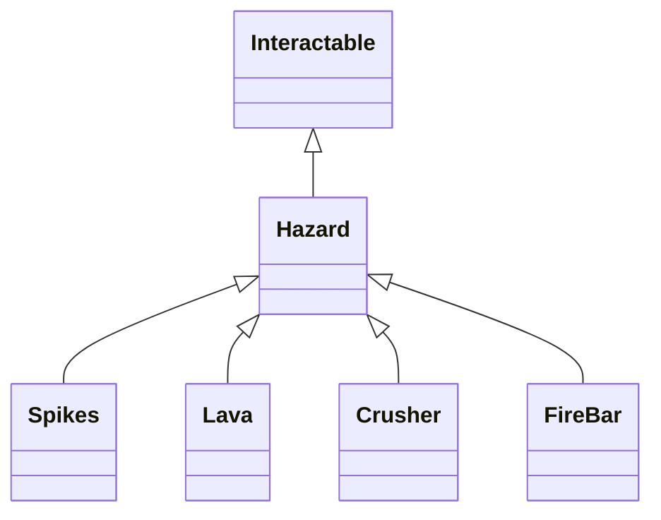

# Dynamic Environmental Hazards Design Plan

## Overview

This plan outlines the design of **dynamic, manipulable environmental hazards** for a two-player asymmetric platformer game. 

- **Player 1:** Platformer, bound by gravity, navigating hazards.
- **Player 2:** Manipulates environment in real-time, unbounded by gravity.
- Hazards can be **moved, toggled, and repositioned** by Player 2 during gameplay.

---

## Core Principles

- All hazards **inherit from `Interactable`** to support toggling on/off.
- All hazards support **dragging and repositioning** by Player 2.
- Hazards have **clear visual states** (active/dangerous vs. inactive/safe).
- Player 1 interacts with hazards via collision (damage/death).
- Player 2 manipulates hazards via toggle and drag.

---

## Base Class: `Hazard`

- Inherits from **`Interactable`**
- Fields:
  - `bool isActive`
  - `Collider2D damageCollider`
- Behaviors:
  - **On collision** with Player 1:
    - If `isActive`, apply damage or kill
  - **OnToggle()**:
    - Switch `isActive`
    - Update visuals and collider state
  - **Drag support**:
    - Similar to `Enemy` drag logic
    - Only Player 2 can drag (input context check)

---

## Specific Hazards

### Spikes
- Static or animated sprite
- Collider triggers damage
- Toggle retracts/extends spikes
- Draggable by Player 2

### Lava
- Large trigger collider
- Animated bubbling
- Toggle enables/disables damage
- Draggable (move lava pools)

### Crusher
- Moving platform with damaging collider
- Toggle enables/disables crushing
- Draggable (reposition crusher)
- Optional: toggle movement on/off

### Fire Bar
- Rotating bar with damaging colliders
- Toggle enables/disables rotation/damage
- Draggable (move rotation center)
- Optional: adjust rotation speed

---

## Class Hierarchy



---

## Player Interactions

```mermaid
sequenceDiagram
    Player1->>Hazard: Collides
    alt Hazard isActive
        Hazard->>Player1: Damage or kill
    else
        Hazard: Ignore
    end

    Player2->>Hazard: Click and drag
    Hazard->>Hazard: Update position

    Player2->>Hazard: Toggle()
    Hazard->>Hazard: Switch active state, update visuals
```

---

## Implementation Outline

1. **Create `Hazard` class**
   - Inherit from `Interactable`
   - Add `isActive` flag
   - Override `OnToggle()` to switch active state, update visuals/collider
   - Implement `OnTriggerEnter2D()` to damage Player 1 if active
   - Add drag logic (similar to `Enemy`)
2. **Implement `Spikes`**
   - Sprite + collider
   - Animate retract/extend on toggle
3. **Implement `Lava`**
   - Large trigger collider
   - Animate bubbling
   - Toggle damage on/off
4. **Implement `Crusher`**
   - Moving platform logic
   - Toggle crushing on/off
   - Draggable
5. **Implement `FireBar`**
   - Rotating hazard
   - Toggle rotation/damage
   - Draggable
6. **Integrate with Level Editor**
   - Prefabs, palette entries
   - Property editing (active state, speed, etc.)
7. **Test multiplayer interactions**
   - Ensure Player 2 can manipulate hazards without affecting Player 1 controls

---

## Summary

This design enables **dynamic, asymmetric gameplay** where Player 2 can actively manipulate hazards to challenge or assist Player 1, creating a rich cooperative or competitive experience.