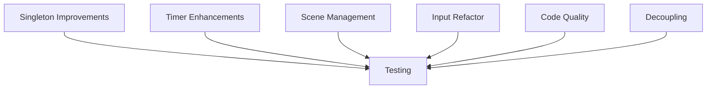

# GameManager.cs Refactor & Best Practices Plan

This document outlines a detailed, atomic, step-by-step plan to improve the `GameManager` script by applying professional coding standards, reducing redundancies, and addressing code smells.

---

## 1. Singleton Pattern Improvements
- **1.1** Change `public static GameManager Instance;` to a property with a private setter.
- **1.2** Make `Instance` assignment thread-safe (optional, low priority in Unity).
- **1.3** Move event subscription to `OnEnable()` and unsubscription to `OnDisable()` for safer lifecycle management.
- **1.4** Add null check warnings if multiple instances are detected.

---

## 2. Timer Logic Enhancements
- **2.1** Clarify timer behavior: decide if it counts up, down, or supports both.
- **2.2** Rename `levelDuration` to `initialTime` or `countdownTime` for clarity.
- **2.3** Add support for countdown mode (if desired).
- **2.4** Implement timer completion logic (e.g., stop timer, trigger event or callback).
- **2.5** Add events or UnityEvents for timer start, stop, and completion.

---

## 3. Scene Management Improvements
- **3.1** Replace magic number `0` for Main Menu with a named constant or enum.
- **3.2** Replace other magic indices with named constants or enums.
- **3.3** Consider async scene loading for smoother transitions.
- **3.4** Add error handling/logging for invalid scene indices.

---

## 4. Input Handling Refactor
- **4.1** Abstract input checks into a dedicated input manager class.
- **4.2** Optionally migrate to Unity's new Input System for scalability.
- **4.3** Remove direct input polling from `GameManager.Update()`.

---

## 5. Code Quality and Style
- **5.1** Add XML documentation comments to all public methods and properties.
- **5.2** Encapsulate public fields with properties where appropriate.
- **5.3** Use `[SerializeField] private` for fields exposed in the Inspector.
- **5.4** Group related fields and methods logically.
- **5.5** Remove redundant or duplicate methods (e.g., unify `ReloadLevel()` and `Restart()`).
- **5.6** Add regions for better code organization (optional).

---

## 6. Decoupling and Extensibility
- **6.1** Use interfaces or events to decouple timer logic from UI updates.
- **6.2** Consider event-driven design for scene transitions and timer events.
- **6.3** Prepare for unit testing by isolating logic into smaller components.

---

## 7. Testing and Validation
- **7.1** After each refactor step, test in Unity Editor for regressions.
- **7.2** Verify timer UI updates correctly.
- **7.3** Verify scene transitions work as expected.
- **7.4** Verify input handling triggers correct actions.
- **7.5** Check console logs for warnings or errors.

---

## Mermaid Diagram: High-Level Refactor Flow

---

## Summary

This plan will modernize the `GameManager` script, improve maintainability, and prepare it for future extensibility. Each atomic step can be implemented and tested incrementally.