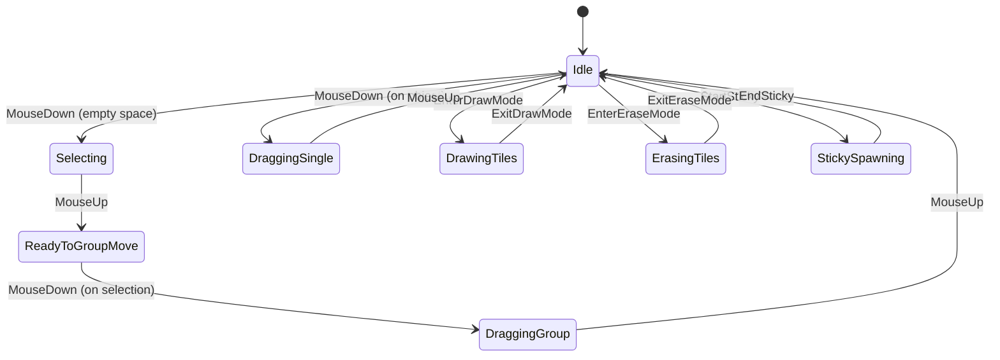

# LevelEditor Finite State Machine (FSM) Refactor Plan

---

## 1. Design a General-Purpose FSM Framework

### Goals
- Reusable for LevelEditor, AI, enemies, UI, etc.
- Lightweight, no dependencies.
- Type-safe with enums or string states.
- Support:
  - State enter/exit callbacks
  - State update/tick
  - Optional transition callbacks
  - Query current state
  - Trigger transitions

### API Sketch
```csharp
public class FiniteStateMachine<TState>
{
    public TState CurrentState { get; }
    public void AddState(TState state, Action onEnter = null, Action onExit = null, Action onUpdate = null);
    public void ChangeState(TState newState);
    public void Update();
}
```

### Implementation Steps
- Create generic class `FiniteStateMachine<TState>`.
- Store state data: enter, exit, update delegates.
- Implement `AddState()`.
- Implement `ChangeState()` with exit/enter calls.
- Implement `Update()` to call current state's update.
- Optional: Add transition validation, events, or conditions.

---

## 2. Define LevelEditor FSM States & Transitions

### States
- **Idle:** Waiting for input.
- **Selecting:** Dragging selection rectangle.
- **ReadyToGroupMove:** Selection made, waiting for user to click on selection.
- **DraggingGroup:** Moving group of tiles/objects.
- **DraggingSingle:** Moving a single object.
- **DrawingTiles:** Painting tiles.
- **ErasingTiles:** Erasing tiles.
- **StickySpawning:** Placing sticky objects.

### Mermaid Diagram


### Transitions
- **Idle → Selecting:** User clicks empty space.
- **Idle → DraggingSingle:** User clicks on object.
- **Selecting → ReadyToGroupMove:** User releases mouse.
- **ReadyToGroupMove → DraggingGroup:** User clicks on selection.
- **DraggingGroup → Idle:** User releases mouse.
- **DraggingSingle → Idle:** User releases mouse.
- **Idle ↔ DrawingTiles:** User toggles draw mode.
- **Idle ↔ ErasingTiles:** User toggles erase mode.
- **Idle ↔ StickySpawning:** User starts/stops sticky spawn.

---

## 3. Refactor LevelEditor to Use FSM

### Step 1: Implement FSM Framework
- Create `FiniteStateMachine<TState>` class in `Assets/Scripts/Utilities/`.
- Write unit tests for FSM transitions.

### Step 2: Define Editor States Enum
```csharp
public enum EditorFSMState
{
    Idle,
    Selecting,
    ReadyToGroupMove,
    DraggingGroup,
    DraggingSingle,
    DrawingTiles,
    ErasingTiles,
    StickySpawning
}
```

### Step 3: Initialize FSM in LevelEditor
- Add `FiniteStateMachine<EditorFSMState> editorFSM;`
- Initialize with all states and callbacks.

### Step 4: Refactor Update Loop
- Replace flag checks (`isGroupMoving`, `isSingleObjectDragging`, etc.) with FSM state checks.
- Dispatch input handling based on `editorFSM.CurrentState`.
- Move per-state logic into FSM state callbacks or separate methods.

### Step 5: Implement State Behaviors
- **Idle:** Listen for clicks to transition.
- **Selecting:** Handle drag rectangle.
- **ReadyToGroupMove:** Wait for click on selection.
- **DraggingGroup:** Update group move preview.
- **DraggingSingle:** Update single object drag.
- **DrawingTiles:** Handle tile painting.
- **ErasingTiles:** Handle tile erasing.
- **StickySpawning:** Handle sticky placement.

### Step 6: Remove Old Flags
- Remove `isGroupMoving`, `groupMoveInProgress`, `isSingleObjectDragging`, `isSelecting`.
- Use FSM state instead.

### Step 7: Test & Polish
- Verify all transitions.
- Test undo/redo.
- Adjust UI feedback.
- Add debug logs for state changes.

---

## 4. Subtasks List

### FSM Framework
- [ ] Create `FiniteStateMachine<TState>` class.
- [ ] Add state registration, enter/exit/update.
- [ ] Add state change method.
- [ ] Add update method.
- [ ] Write unit tests.

### LevelEditor FSM Integration
- [ ] Define `EditorFSMState` enum.
- [ ] Add FSM instance to LevelEditor.
- [ ] Register all states with enter/exit/update.
- [ ] Refactor Update() to dispatch based on FSM state.
- [ ] Migrate selection logic to FSM.
- [ ] Migrate group move logic to FSM.
- [ ] Migrate single drag logic to FSM.
- [ ] Migrate drawing/erasing logic to FSM.
- [ ] Migrate sticky spawn logic to FSM.
- [ ] Remove obsolete flags and code.
- [ ] Test all transitions and behaviors.
- [ ] Polish UI and feedback.

---

## Summary

This plan will transform LevelEditor into a **clean, explicit FSM-driven system** with:

- Clear, manageable states.
- Predictable, fluid user experience.
- Easier maintenance and extension.
- A reusable FSM framework for other gameplay systems.