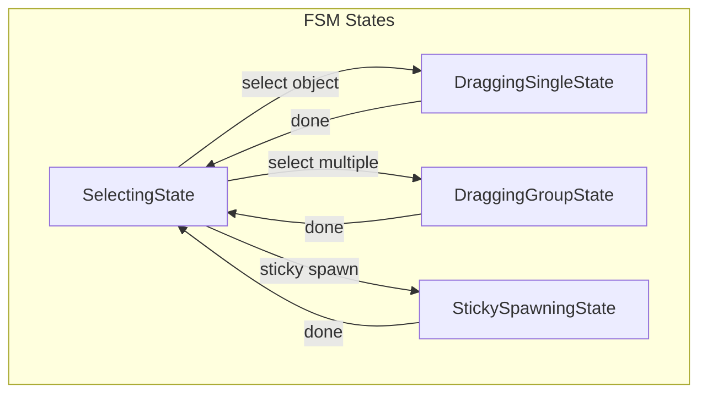

# LevelEditor Highlight Refactor Plan

## Goal
Ensure **consistent, efficient, and bug-free highlight material management** for LevelObjects during:

- **Selection**
- **Single dragging**
- **Group dragging**
- **Sticky spawning**

---

## Current Issues
- Highlights sometimes **not applied** or **not removed**
- Highlights **linger** after sticky spawn or drag ends
- Highlights **applied redundantly** every frame (inefficient)
- Null references if objects lack materials

---

## Design Principles
- **Single source of truth**: FSM context tracks which objects are highlighted
- **Apply highlight** **only once** when entering a state
- **Restore original material** when exiting a state
- **Handle null materials** gracefully
- **No redundant per-frame assignments**

---

## Proposed Architecture

---

## Highlight Logic by State

### SelectingState
- On enter:
  - **Highlight all selected objects**
- On exit:
  - **Restore all highlighted objects**

### DraggingSingleState
- On enter:
  - **Highlight activeEditingObject**
- On exit:
  - **Restore activeEditingObject**

### DraggingGroupState
- On enter:
  - **Highlight all selected objects**
- On exit:
  - **Restore all highlighted objects**

### StickySpawningState
- On enter:
  - **Highlight stickyObject** (if exists)
- On exit:
  - **Restore stickyObject** (if exists)

---

## Implementation Details

- Use a **Dictionary<LevelObject, Material> originalMaterials** in FSM context
- When **applying highlight**:
  - If not already saved, **store original material** (can be null)
  - Set highlight material
- When **restoring**:
  - If original was null, set material to null
  - Else, restore saved material
- **Clear dictionary** on exit of each state

---

## Summary

- **Highlights applied once** on state enter
- **Restored once** on state exit
- **No redundant per-frame assignments**
- **No highlight leaks**
- **Consistent glow behavior** for selection, dragging, and sticky spawning

---

## Next Steps

- Refactor FSM states to follow this plan
- Test all transitions thoroughly
- Confirm no highlight leaks or missed highlights