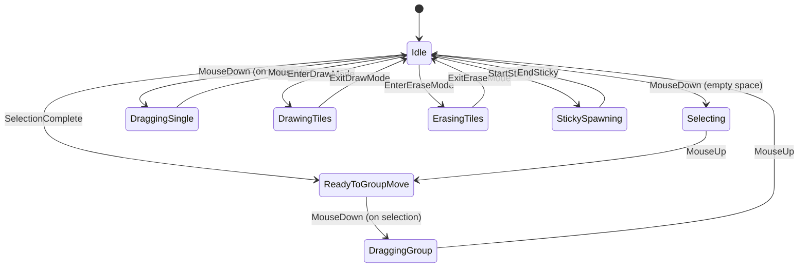
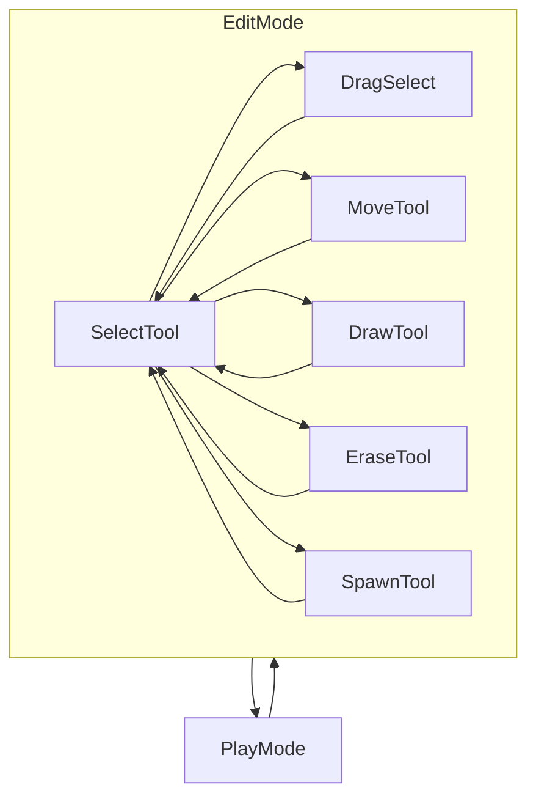

# LevelEditor Refactor Options

This document proposes several architectural options to cleanly refactor the **LevelEditor** selection and group move system, addressing current complexity and improving maintainability.

---

## Core Problems Identified

- **Overlapping, tangled states:** `isGroupMoving`, `groupMoveInProgress`, `isSingleObjectDragging`, `isSelecting` interact in complex ways.
- **Implicit vs explicit actions:** Group move sometimes starts automatically, sometimes on click.
- **Inconsistent UX:** User flow is unpredictable.
- **Hard to extend:** Adding new features risks breaking existing logic.
- **Difficult to debug:** Many flags, edge cases, and timing issues.

---

## Refactor Goals

- **Explicit, predictable states and transitions.**
- **Clear separation of concerns.**
- **Intuitive user experience.**
- **Easier to maintain, debug, and extend.**
- **Support undo/redo cleanly.**

---

# Option A: Finite State Machine (FSM)

### Concept
Model the editor as a **finite state machine** with explicit states and transitions.

### Key States
- `Idle`
- `Selecting`
- `DraggingSingle`
- `ReadyToGroupMove`
- `DraggingGroup`
- `DrawingTiles`
- `ErasingTiles`
- `StickySpawning`

### Mermaid Diagram

### Pros
- Explicit, manageable states.
- Predictable transitions.
- Easier to debug.
- Cleanly extendable.

### Cons
- Requires refactoring input handling.
- Slightly more boilerplate.

### Implementation Steps
- Define enum `EditorState`.
- Centralize input handling based on state.
- Remove overlapping flags.
- Implement state transitions explicitly.

---

# Option B: Mode + Tool Pattern

### Concept
Inspired by Photoshop/GIMP:  
- **Modes:** Play, Edit  
- **Tools:** Select, Move, Draw, Erase, Spawn

User explicitly chooses a tool, which determines behavior.

### Mermaid Diagram

### Pros
- Familiar UX.
- Clear separation of tool behaviors.
- Easy to add new tools.
- Less state complexity.

### Cons
- Requires UI for tool switching.
- Slightly less fluid than FSM.

### Implementation Steps
- Define `EditorTool` enum.
- Implement tool behaviors separately.
- UI buttons or hotkeys to switch tools.
- Simplify input handling per tool.

---

# Option C: Event-Driven + Command Pattern

### Concept
- Use **events** for user actions (click, drag, release).
- Use **Command pattern** for all operations (move, select, draw).
- Supports undo/redo naturally.
- Decouple input from logic.

### Pros
- Clean undo/redo.
- Decoupled, testable code.
- Extensible.

### Cons
- More complex initial setup.
- Requires event system.

### Implementation Steps
- Define events for input.
- Implement commands for actions.
- Dispatch events to commands.
- Manage command history.

---

# Option D: Hybrid FSM + Tool Pattern

### Concept
Combine **FSM** for high-level states (Play, Edit, Sticky)  
with **Tool pattern** inside Edit mode (Select, Move, Draw, Erase).

### Pros
- Best of both worlds.
- Explicit states + flexible tools.
- Intuitive UX.

### Cons
- Slightly more complex.
- Needs careful design.

### Implementation Steps
- FSM for mode/state.
- Tool pattern inside Edit.
- Input routed based on both.

---

# Summary Table

| Option | Explicit States | Familiar UX | Undo/Redo Friendly | Complexity | Extensibility |
|---------|----------------|-------------|--------------------|------------|---------------|
| **A. FSM** | High           | Medium      | Medium             | Medium     | High          |
| **B. Tool**| Medium          | High        | Medium             | Low        | High          |
| **C. Event+Cmd** | Medium    | Medium      | High               | High       | High          |
| **D. Hybrid** | High        | High        | Medium-High        | Medium-High| High          |

---

# Next Steps

- Review these options.
- Decide on preferred architecture.
- Break down into implementation phases.
- Plan incremental refactor with tests.

---

# Notes

- All options will **reduce flag spaghetti** and improve maintainability.
- All support **cleaner undo/redo** integration.
- All can be extended with new features like multi-layer editing, advanced selection, etc.