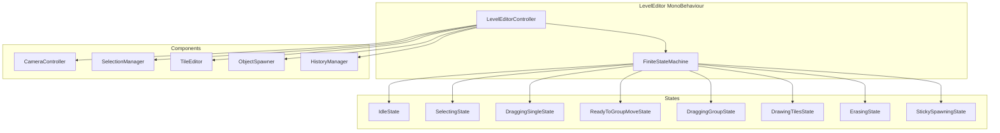

# LevelEditor.cs Refactoring Plan: FSM-Based Modular Architecture

---

## Overview

Refactor the large `LevelEditor.cs` into smaller, maintainable files using a **Finite State Machine (FSM)** approach, leveraging the existing `FiniteStateMachine<T>` and `EditorFSMState` enum.

---

## Goals

- Replace enum + boolean state management with a **clean FSM**
- Extract **state-specific logic** into dedicated classes
- Modularize concerns: **camera, selection, tile editing, object spawning, undo/redo**
- Improve maintainability, testability, and clarity

---

## Existing Resources

- **`FiniteStateMachine.cs`**: Generic FSM implementation
- **`EditorFSMState.cs`**: Enum of editor states

---

## Target Architecture

---

## Step-by-Step Plan

### **Phase 1: FSM Integration**

- Replace `EditorState` enum and booleans with `FiniteStateMachine<EditorFSMState>`
- Initialize FSM in `LevelEditorController`
- Define states with `fsm.AddState()` (enter, update, exit)
- Call `fsm.Update()` in MonoBehaviour's `Update()`

---

### **Phase 2: Extract State Classes**

Create classes implementing FSM callbacks:

| **State Enum**          | **Class Name**            | **Responsibility**                          |
|-------------------------|---------------------------|--------------------------------------------|
| `Idle`                  | `IdleState`               | Default state, no interaction              |
| `Selecting`             | `SelectingState`          | Drag rectangle, multi-select               |
| `DraggingSingle`        | `DraggingSingleState`     | Dragging one object                        |
| `ReadyToGroupMove`      | `ReadyToGroupMoveState`   | Awaiting group move initiation             |
| `DraggingGroup`         | `DraggingGroupState`      | Dragging multiple objects/tiles            |
| `DrawingTiles`          | `DrawingTilesState`       | Tile drawing, flood fill                   |
| `ErasingTiles` (renamed)| **`ErasingState`**        | Tile/object erasing                        |
| `StickySpawning`        | `StickySpawningState`     | Sticky object placement                    |

---

### **Phase 3: Extract Components**

| **Component**         | **File**                   | **Responsibility**                          |
|-----------------------|----------------------------|--------------------------------------------|
| CameraController      | `CameraController.cs`      | Zoom, pan                                  |
| SelectionManager      | `SelectionManager.cs`      | Manage selected objects/tiles              |
| TileEditor            | `TileEditor.cs`            | Tile placement, erasing, flood fill        |
| ObjectSpawner         | `ObjectSpawner.cs`         | Prefab instantiation, sticky spawn         |
| HistoryManager        | `HistoryManager.cs`        | Undo/redo                                  |

---

### **Phase 4: Refactor UI Wiring**

- Move UI event listeners to a dedicated `LevelEditorUI` or `LevelEditorController`
- UI triggers FSM state changes or component actions

---

### **Phase 5: Utilities**

- Move `DragArea` struct to `DragArea.cs`
- Move `Extensions` class to `Extensions.cs`
- Place under `Assets/Scripts/Utilities/` or `LevelEditorSystem` namespace

---

## Summary Table

| **Module**               | **Responsibility**                                  | **File**                                   |
|--------------------------|-----------------------------------------------------|--------------------------------------------|
| `LevelEditorController`  | Initialize FSM, hold references, coordinate        | `LevelEditorController.cs`                 |
| `FiniteStateMachine`     | FSM logic (already exists)                         | `FiniteStateMachine.cs`                    |
| `EditorFSMState`         | Enum of states (already exists)                    | `EditorFSMState.cs`                        |
| `IdleState`              | Default idle state                                 | `IdleState.cs`                            |
| `SelectingState`         | Selection rectangle, multi-select                  | `SelectingState.cs`                        |
| `DraggingSingleState`    | Dragging one object                                | `DraggingSingleState.cs`                   |
| `ReadyToGroupMoveState`  | Awaiting group move initiation                     | `ReadyToGroupMoveState.cs`                 |
| `DraggingGroupState`     | Dragging multiple objects/tiles                    | `DraggingGroupState.cs`                    |
| `DrawingTilesState`      | Tile drawing, flood fill                           | `DrawingTilesState.cs`                     |
| `ErasingState`           | Tile/object erasing                                | `ErasingState.cs`                          |
| `StickySpawningState`    | Sticky object placement                            | `StickySpawningState.cs`                   |
| `CameraController`       | Zoom, pan                                          | `CameraController.cs`                      |
| `SelectionManager`       | Manage selected objects/tiles                      | `SelectionManager.cs`                      |
| `TileEditor`             | Tile placement, erasing, flood fill                | `TileEditor.cs`                            |
| `ObjectSpawner`          | Prefab instantiation, sticky spawn                 | `ObjectSpawner.cs`                         |
| `HistoryManager`         | Undo/redo                                          | `HistoryManager.cs`                        |
| `DragArea`               | Drag rectangle utility                             | `DragArea.cs`                              |
| `Extensions`             | Vector3 extensions                                 | `Extensions.cs`                            |

---

## Expected Benefits

- **Cleaner separation of concerns**
- **Simpler state management**
- **Easier debugging and testing**
- **Unity best practices compliance**
- **Incremental, manageable refactor**

---

## Next Steps

- Switch to **Code Mode** to begin implementation
- Incrementally extract FSM and components
- Test after each phase