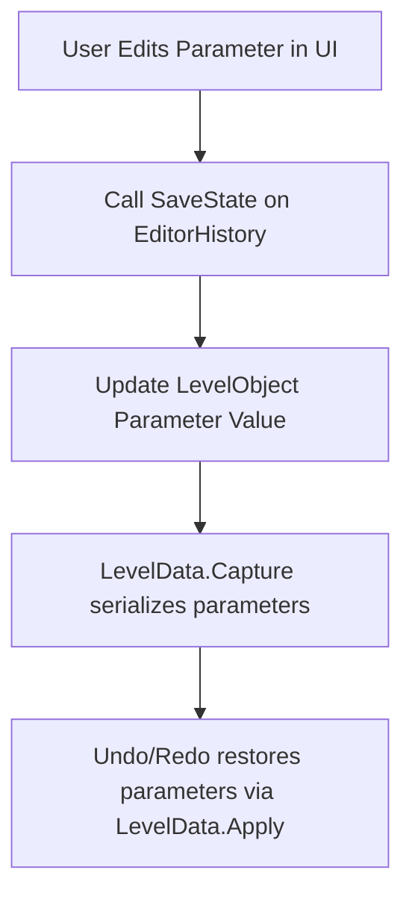

# Parameter History Integration Plan

**Goal:**  
Enable full undo/redo support for all player-editable parameters in LevelObjects, using the existing EditorHistory and LevelData systems.

---

## 1. Add Serializable Parameter Support

- **Create a `ParameterData` structure** to represent editable parameters (name, type, value).
- **Extend `LevelData.ObjectData`:**
  - Add `List<ParameterData> parameters`.
- **Update LevelObject subclasses:**
  - Implement methods to export/import parameters to/from `ParameterData`.
  - Use an interface (e.g., `IParameterEditable`) for consistency.

---

## 2. Update LevelData Serialization

- **In `LevelData.Capture`:**
  - For each LevelObject, call its export method to serialize parameters into `ObjectData.parameters`.
- **In `LevelData.Apply`:**
  - After instantiating each object, call its import method to restore parameters from `ObjectData.parameters`.

---

## 3. Update Parameter Editing UI

- **Reflect parameters in the UI:**
  - Read and display all editable parameters for selected object(s).
  - Write changes back to LevelObject and update `parameters` list.
- **Batch editing:**
  - Show only parameters common to all selected objects (by name/type).
  - Support batch editing and mixed value indicators.

---

## 4. Integrate with Undo/Redo

- **Call `EditorHistory.SaveState` before any parameter change** (single or batch edit).
- **Test:**  
  - Verify parameter changes are undoable/redone, along with other level changes.

---

## 5. Best Practices & Extensibility

- **Parameter metadata:**  
  - Use attributes or a registration system to define which fields are editable and their UI representation.
- **Versioning:**  
  - Plan for future changes to `ParameterData` (add version field if needed).
- **Documentation:**  
  - Document how to add new parameters to LevelObjects and ensure they are included in serialization.

---

## Mermaid Diagram: Parameter Edit & Undo/Redo Workflow

---

## Implementation Checklist

- [ ] Define `ParameterData` and update `LevelData.ObjectData`.
- [ ] Implement export/import methods for all parameter-editable LevelObjects.
- [ ] Update parameter editing UI for dynamic parameter lists and batch editing.
- [ ] Ensure `SaveState` is called before parameter changes.
- [ ] Test undo/redo for parameter edits.
- [ ] Document the workflow for future maintainers.

---

**This plan is optimized for LLMs and developers with write access to the codebase. Follow each step to ensure robust, extensible parameter history support.**