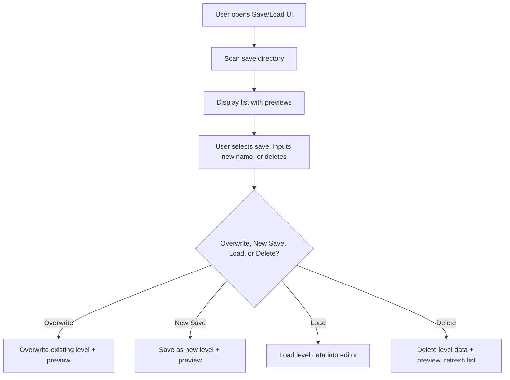

# Save/Load UI with Level Previews and Delete Support

## Overview
Design a Unity UI interface to:
- Display previews of all saved levels
- Facilitate saving and loading levels
- Allow overwriting existing saves or saving as new
- **Support deleting saved levels**

---

## Subtasks

### 1. Level Preview Generation
- Generate a thumbnail/screenshot when saving a level
- Save preview alongside level data (e.g., PNG with same filename)
- Alternatively, generate previews on demand

### 2. Saved Level Discovery
- Scan save directory for level files
- For each, check for preview image
- Build a list of save entries with metadata (name, timestamp, preview path)

### 3. UI Design
- Scrollable grid/list panel
- Each entry shows:
  - Preview image
  - Level name
  - **Load button**
  - **Overwrite button**
  - **Delete button**
- Input field for new save name
- "Save As New" button

### 4. Save Logic
- Overwrite existing save or create new save with input name
- Generate and save preview image

### 5. Load Logic
- Load selected level data into editor

### 6. Delete Logic
- Confirm deletion (optional)
- Delete level data file
- Delete preview image file
- Refresh UI list

### 7. Integration
- Add button/menu to open save/load UI
- Disable editing while UI open or allow background editing

---

## Flow Diagram

---

## Notes
- Consider adding confirmation dialogs for deletes
- Optionally support sorting/filtering saves
- Optionally support async loading for large previews
- Can extend metadata (date, tags, etc.) in future