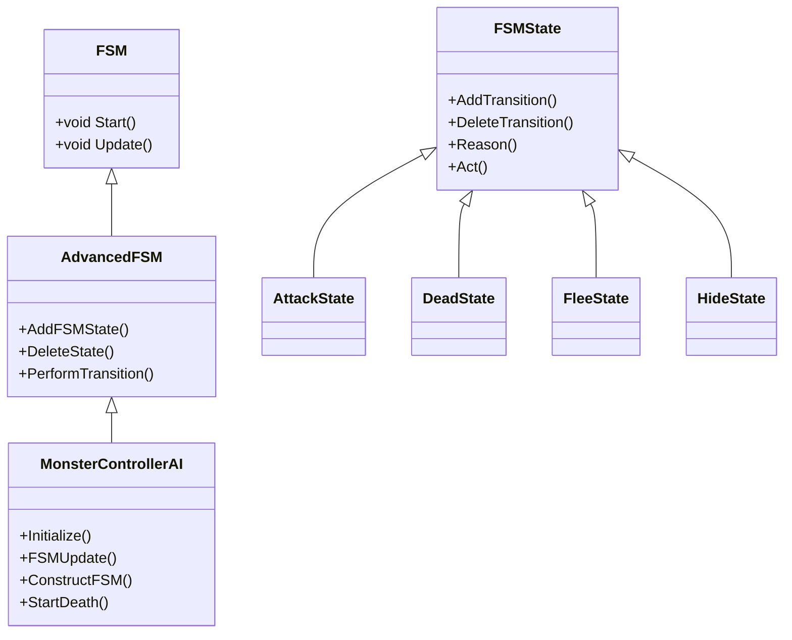
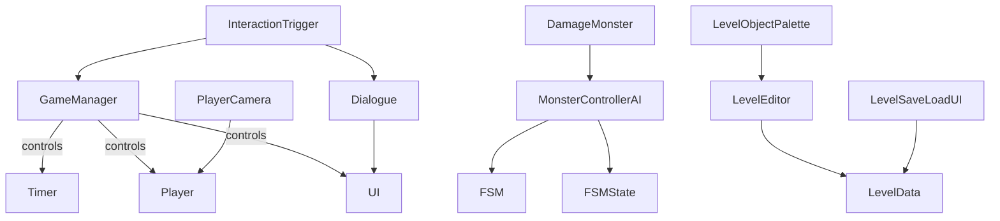

# Unity Project Script Analysis

---

## 1. Top-Level Scripts
*(See previous sections)*

---

## 2. AI System
*(See previous sections)*

---

## 3. Dialogue System
*(See previous sections)*

---

## 4. Gameplay Components
*(See previous sections)*

---

## 5. Editor Utilities
*(See previous sections)*

---

## 6. Diagrams

### **AI FSM Architecture**

---

### **Overall Script Interactions**

---

## 7. Improvement Suggestions

- **Consistent Naming:** Fix typos (e.g., `TImer.cs` → `Timer.cs`), use PascalCase for classes, camelCase for variables.
- **Documentation:** Add XML summary comments for all classes and methods.
- **Magic Strings:** Replace `GameObject.Find()` strings with serialized fields or constants.
- **Decoupling:** Use inspector references instead of runtime `Find()` calls where possible.
- **Singletons:** Consider ScriptableObjects or dependency injection for shared data.
- **Code Organization:** Use `#region` tags to group related methods.
- **Comments:** Add inline comments explaining complex logic.
- **Simplify Logic:** Refactor large methods into smaller, focused ones.
- **Novice Friendliness:** Use clear, descriptive variable and method names.
- **Error Handling:** Add null checks and warnings for missing references.
- **Modularity:** Break up large classes (e.g., `GameManager`) into smaller components if feasible.

---

*End of Analysis Report*