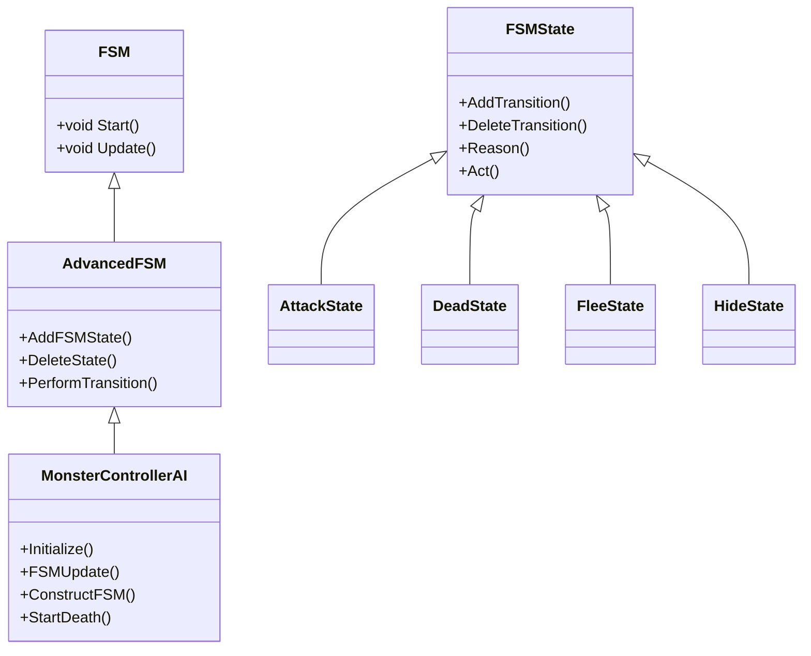
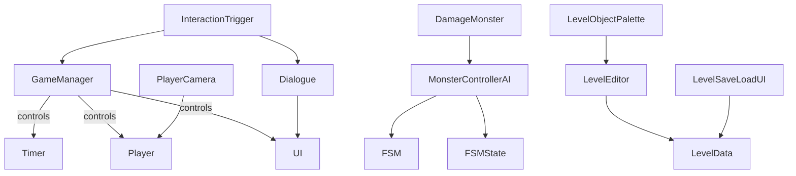

# Unity Project Script Analysis & Improvement Plan

---

## Overview

This document outlines a comprehensive plan to analyze **all Unity scripts** in the `Assets/Scripts/` directory and its subfolders. The goal is to understand their functions, interactions, and provide actionable improvements for clarity, maintainability, and novice-friendliness.

---

## 1. Categorization of Scripts

### **Top-Level Scripts**
- **GameManager.cs**: Game state, timer, scene management
- **Interaction Trigger.cs**: Player interactions, dialogue, level transitions
- **Level.cs**: Placeholder for level logic
- **PlayerCamera.cs**: Camera follow and zoom
- **TImer.cs**: Global timer across levels

### **AI System**
- **FSM Core**: `FSM.cs`, `AdvancedFSM.cs`, `FSMState.cs`
- **Monster Controller**: `MonsterControllerAI.cs`
- **Monster States**: `AttackState.cs`, `DeadState.cs`, `FleeState.cs`, `HideState.cs`
- **Damage Handling**: `DamageMonster.cs`

### **Dialogue System**
- **Dialogue.cs**: Dialogue management, quips, UI updates

### **Gameplay Components**
- **Player.cs**, **Enemy.cs**, **Door.cs**, **Mover.cs**, **RigidRotator.cs**, **SmoothRotator.cs**

### **Editor Utilities**
- **LevelEditor.cs**, **LevelData.cs**, **LevelSaveLoadUI.cs**, **LevelObjectPalette.cs**, **TilesetManager.cs**, **EditorHistory.cs**, **Interactable.cs**, **InteractableGroup.cs**, **HoverIndicator.cs**, **LevelEntry.cs**, **SpawnGrabbedPrefab.cs**

### **Tilemap**
- **PlatTestScript.cs**

---

## 2. Script Function Summaries

For each script:
- **Purpose**
- **Key variables and methods**
- **Unity lifecycle hooks**
- **Singleton/static patterns**
- **Dependencies**

---

## 3. Interaction Mapping

- **Singletons**: `GameManager`, `Timer`
- **FSM**: AI state transitions
- **Dialogue triggers**: via `InteractionTrigger`
- **Player ↔ Camera**
- **Gameplay ↔ UI**
- **Editor tools ↔ Level data**

---

## 4. Code Quality & Clarity Review

- Naming conventions & typos
- Comments & XML documentation
- Method complexity
- Unity best practices adherence
- Magic strings/numbers
- Coupling & cohesion
- Error handling
- Novice-friendliness

---

## 5. Improvement Suggestions

- Consistent naming
- Add XML docs and comments
- Replace magic strings with constants or serialized fields
- Decouple UI lookups
- Modularize large classes
- Simplify singleton patterns
- Clarify method/variable names
- Add explanatory comments
- Organize code with regions

---

## 6. Diagrams

### **AI FSM Architecture**

### **Overall Script Interactions**

---

## 7. Deliverables

- **Script summaries**
- **Interaction overview**
- **Code quality evaluation**
- **Improvement suggestions**
- **Diagrams**

---

## 8. Next Steps

- Execute this plan to produce a detailed report.
- Review findings and prioritize improvements.
- Implement code refactoring and documentation.

---

*Prepared by Roo, Architect Mode*